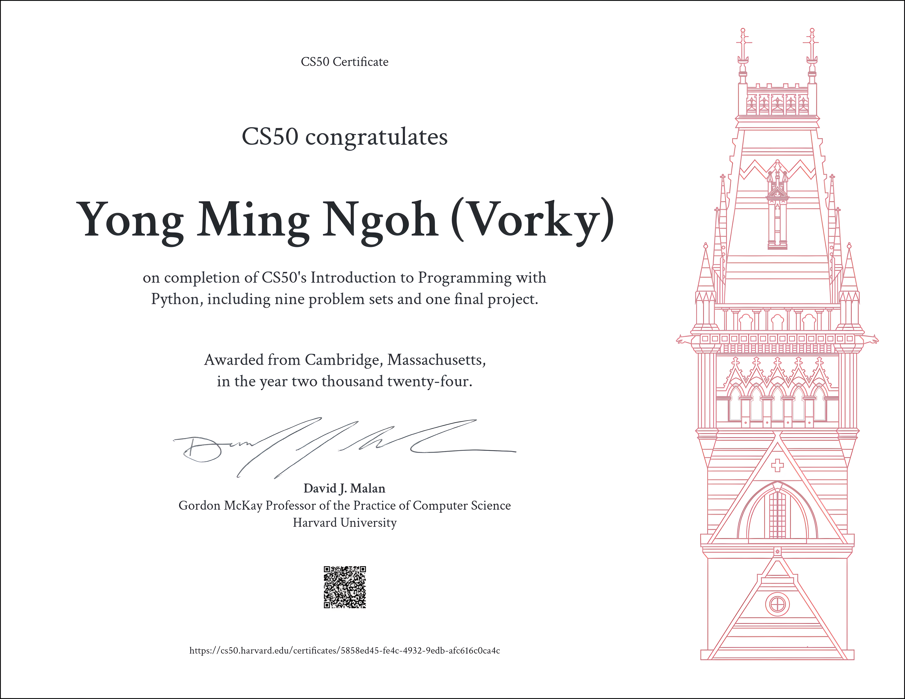
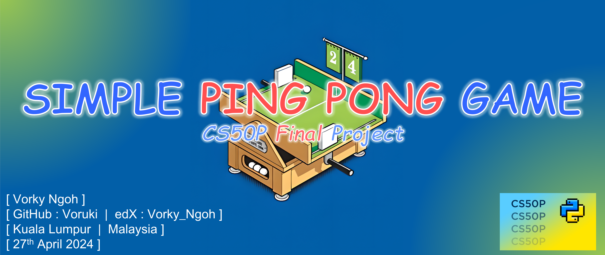

# CS50’s Introduction to Programming with Python 🐍

### Above are my proposed solutions for CS50's Introduction to Programming with Python, 2024 edition.

 

### Final Project: [Simple Table Tennis Game 🏓](https://www.youtube.com/watch?v=7wL_XpK6ztc)
#### In contrast to other accounts, I have included both my project codes and test codes within this repository for reference purposes, aiding others in crafting their own final projects for this course. Please be aware that the program is designed to operate solely on Windows devices.

 

## ⚠️ Disclaimer:

### ❗ **The following code snippets are provided solely for educational purposes and are not intended to be utilized or submitted as one's own solutions.**

### ❗ **Engaging in cheating contravenes the [Academic Honesty](https://cs50.harvard.edu/python/2022/honesty/) policy of the course and undermines the purpose of learning programming effectively.**

 

## Table of Contents
### [Week 0](/Week_0/) - [Functions, Variables](https://cs50.harvard.edu/python/2022/weeks/0/)
- [Indoor Voice](/Week_0/1_Indoor_Voice/)
- [Playback Speed](/Week_0/2_Playback_Speed/)
- [Making Faces](/Week_0/3_Making_Faces/)
- [Einstein](/Week_0/4_Einstein/)
- [Tip Calculator](/Week_0/5_Tip_Calculator/)

### [Week 1](/Week_1/) - [Conditionals](https://cs50.harvard.edu/python/2022/weeks/1/)
- [Deep Thought](/Week_1/1_Deep_Thought/)
- [Home Federal Savings Bank](/Week_1/2_Home_Federal_Savings_Bank/)
- [File Extensions](/Week_1/3_File_Extensions/)
- [Math Interpreter](/Week_1/4_Math_Interpreter/)
- [Meal Time](/Week_1/5_Meal_Time/)

### [Week 2](/Week_2/) - [Loops](https://cs50.harvard.edu/python/2022/weeks/2/)
- [camelCase](/Week_2/1_camelCase/)
- [Coke Machine](/Week_2/2_Coke_Machine/)
- [Just setting up my twttr](/Week_2/3_Just_setting_up_my_twttr/)
- [Vanity Plates](/Week_2/4_Vanity_Plates/)
- [Nutrition Facts](/Week_2/5_Nutrition_Facts/)

### [Week 3](/Week_3/) - [Exceptions](https://cs50.harvard.edu/python/2022/weeks/3/)
- [Fuel Gauge](/Week_3/1_Fuel_Gauge/)
- [Felipe's Taqueria](/Week_3/2_Felipe's_Taqueria/)
- [Grocery List](/Week_3/3_Grocery_List/)
- [Outdated](/Week_3/4_Outdated/)

### [Week 4](/Week_4/) - [Libraries](https://cs50.harvard.edu/python/2022/weeks/4/)
- [Emojize](/Week_4/1_Emojize/)
- [Frank, Ian and Glen's Letters](/Week_4/2_Frank,_Ian_and_Glen's_Letters/)
- [Adieu, Adieu](/Week_4/3_Adieu,_Adieu/)
- [Guessing Game](/Week_4/4_Guessing_Game/)
- [Little Professor](/Week_4/5_Little_Professor/)
- [Bitcoin Price Index](/Week_4/6_Bitcoin_Price_Index/)

### [Week 5](/Week_5/) - [Unit Tests](https://cs50.harvard.edu/python/2022/weeks/5/)
- [Testing my twttr](/Week_5/1_Testing_my_twttr/)
- [Back to the Bank](/Week_5/2_Back_to_the_Bank/)
- [Re-requesting a Vanity Plate](/Week_5/3_Re-requesting_a_Vanity_Plate/)
- [Refueling](/Week_5/4_Refueling/)

### [Week 6](/Week_6/) - [File I/O](https://cs50.harvard.edu/python/2022/weeks/6/)
- [Lines of Code](/Week_6/1_Lines_of_Code/)
- [Pizza Py](/Week_6/2_Pizza_Py/)
- [Scourgify](/Week_6/3_Scourgify/)
- [CS50 P-Shirt](/Week_6/4_CS50_P-Shirt/)

### [Week 7](/Week_7/) - [Regular Expressions](https://cs50.harvard.edu/python/2022/weeks/7/)
- [NUMB3RS](/Week_7/1_NUMB3RS/)
- [Watch on YouTube](/Week_7/2_Watch_on_YouTube/)
- [Working 9 to 5](/Week_7/3_Working_9_to_5/)
- [Regular, um, Expressions](/Week_7/4_Regular,um,Expressions/)
- [Response Validation](/Week_7/5_Response_Validation/)

### [Week 8](/Week_8/) - [Object-Oriented Programming](https://cs50.harvard.edu/python/2022/weeks/8/)
- [Seasons of Love](/Week_8/1_Seasons_of_Love/)
- [Cookie Jar](/Week_8/2_Cookie_Jar/)
- [CS50 Shirtificate](/Week_8/3_CS50_Shirtificate/)

### [Week 9](/Week_9/) - [Et Cetera](https://cs50.harvard.edu/python/2022/weeks/9/)

### [Final Week](/Week_Final/) - [Final Project](https://cs50.harvard.edu/python/2022/project/)
- [Project and Project Test Codes](/Week_Final/Project_Codes/)
- [Musics and Graphics Library](/Week_Final/Musics_and_Graphics/)
- [Requirements and README](/Week_Final/)

 
